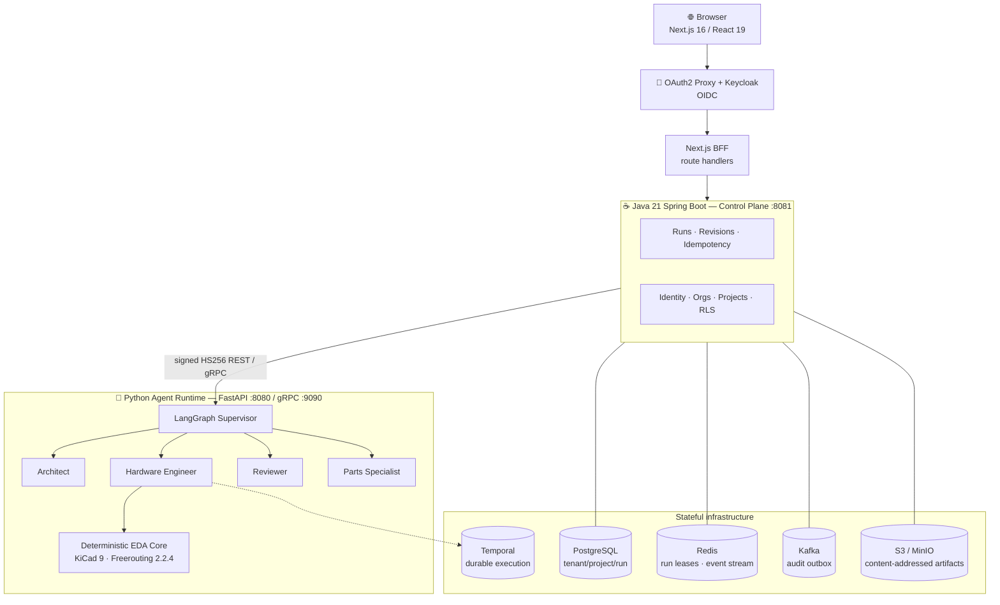
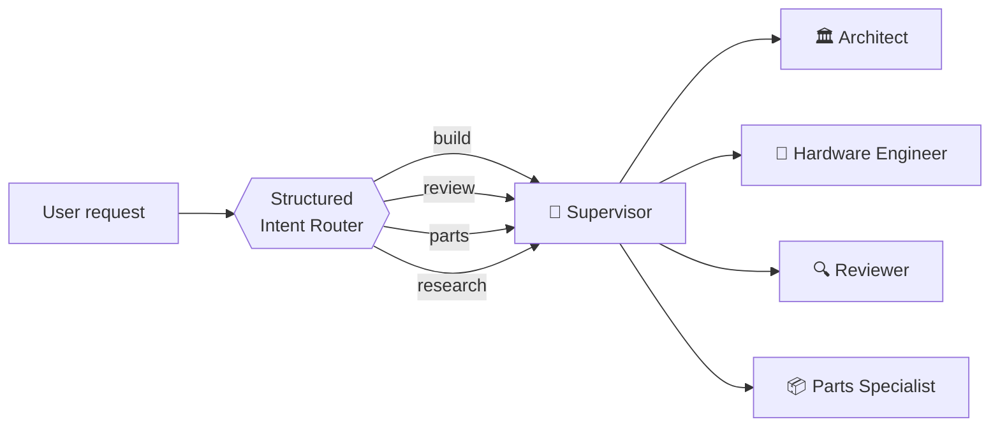
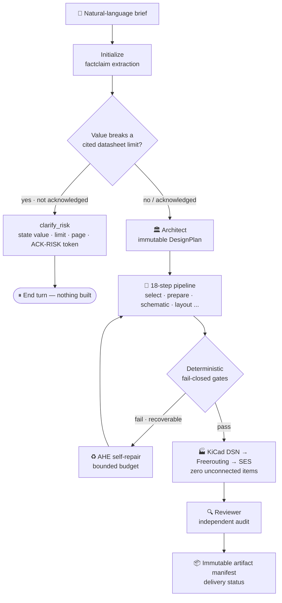

<div align="center">

# RatsNestPro

**English** · [简体中文](README.zh-CN.md)

**A multi-agent hardware-engineering platform that turns a plain-language brief into a manufacturable, DRC-clean KiCad PCB — and refuses to lie about whether it's ready.**

A supervised team of LLM agents designs, builds, verifies, reviews, repairs, and routes printed circuit boards.
Every "pass" is decided by deterministic checks against real EDA tool output and the filesystem — never by the model's own narration.

[](LICENSE)
[](https://www.python.org/)
[](https://github.com/langchain-ai/langgraph)
[](https://fastapi.tiangolo.com/)
[](https://nextjs.org/)
[](https://openjdk.org/)
[](https://github.com/AAADASDASSSSSSSSSSSS/wow/actions/workflows/test.yml)
[](#contributing)

[Features](#-key-features) · [Architecture](#-architecture) · [The Agent Team](#-the-agent-team) · [How It Works](#-how-it-works) · [Quick Start](#-quick-start) · [Configuration](#-configuration) · [Docs](#-documentation)

</div>

---

## Table of Contents

- [What is RatsNestPro?](#what-is-ratsnestpro)
- [Why it's different](#why-its-different)
- [Key Features](#-key-features)
- [Architecture](#-architecture)
- [The Agent Team](#-the-agent-team)
- [How It Works](#-how-it-works)
- [Tech Stack](#-tech-stack)
- [Quick Start](#-quick-start)
- [Configuration](#-configuration)
- [Usage Examples](#-usage-examples)
- [Project Structure](#-project-structure)
- [Testing & Benchmarks](#-testing--benchmarks)
- [Security](#-security)
- [Documentation](#-documentation)
- [Roadmap](#-roadmap)
- [Contributing](#contributing)
- [License & Acknowledgements](#license--acknowledgements)

---

## What is RatsNestPro?

RatsNestPro takes a hardware requirement written in ordinary language —

> *"Design a two-layer STM32F103C8T6 board, USB-C powered (power only, no data), with a 3.3 V rail, an SPI flash, an I²C sensor, and a status LED on PC13."*

— and drives it through a real electronic-design-automation (EDA) pipeline to a routed KiCad project with an immutable, downloadable artifact manifest. A supervised team of specialized agents does the requirement analysis, part selection, schematic and layout generation, autorouting, independent review, and bounded self-repair.

The name says the goal: a *ratsnest* is the tangle of unrouted connections on a fresh PCB. RatsNestPro turns that tangle into a clean, verified, manufacturable board.

It ships in two forms:

- **A LangGraph agent runtime** you can run locally and drive from a Streamlit console — great for development and evaluation.
- **A production multi-tenant SaaS shell** — Next.js browser workspace, Java control plane, OIDC auth, durable runs, audit streaming, and content-addressed artifact storage.

RatsNestPro is built on top of the open-source [agent-service-toolkit](https://github.com/JoshuaC215/agent-service-toolkit) framework.

---

## Why it's different

Most "AI builds your PCB" demos let the language model grade its own homework: the model says *"the board looks good, all checks pass,"* and that sentence becomes the result. RatsNestPro is built on the opposite principle.

> **The trust boundary is deterministic.** LLMs decide *what to do* and *explain* the outcome. They never decide *whether it passed.* Gate verdicts, ERC/DRC results, connectivity, and part identity are computed by deterministic code that reads only tool output and the filesystem — so a report **cannot be talked into looking better than the board actually is.**

Three consequences of that principle define the project:

1. **Fail-closed gates.** An 18-step, knowledge-driven pipeline where every step has checks that block on failure. A downgraded check is still reported (with the citation it overrode); it is never silently deleted.
2. **Grounded, not hallucinated.** Parts come from a local JLCPCB catalog or an explicitly configured procurement API (no invented MPN/LCSC codes). Symbols and footprints are resolved against the installed KiCad libraries. Routing must actually complete: KiCad DSN → Freerouting → SES with **zero unconnected items** is a blocking production gate.
3. **Honest delivery status.** A run resolves to exactly one of `execution_blocked`, `delivered_with_issues`, or `release_ready`. Readiness is derived from evidence, never inferred from prose.

---

## ✨ Key Features

### 🤖 A real role-based agent team
Not a pile of classes named "agent." A LangGraph **supervisor** delegates to four specialists with distinct prompts, contracts, permissions, and bounded tool authority. Handoffs are typed Pydantic models, not free-form prose. The Hardware Engineer, for example, can only apply validated `set_param` operations — it cannot write arbitrary files or execute a shell.

### 🔒 Deterministic fail-closed verification
The authoritative core is deterministic. The 18-step pipeline runs real ERC/DRC and connectivity checks; a failing gate blocks and emits an actionable instruction. The independent Reviewer **cannot alter gate severities** — it audits and narrates, it does not overrule.

### 🧠 Pre-build risk arbitration (ACK-RISK)
Before any design work runs, a `build` request is arbitrated against device **fact sheets**. If a requested value breaks a cited datasheet limit, the graph stops and states the value, the limit, the page it came from, and the exact `ACK-RISK:` token that would accept it. Deterministic code discards any token that wasn't actually offered — so a hallucinated or over-generous reply **cannot waive a limit the user never saw.**

### ♻️ Self-healing and self-evolving (AHE + EHE)
- **AHE — Agentic Hardware Engineering:** within a single task, observe → diagnose → repair → continue, under strict budgets (repairs, wall-clock, tokens).
- **EHE — Evolutionary Harness Engineering:** across tasks, generalize recurring capability gaps, then generate, validate, and publish harness improvements in isolation.

### 🧭 Structured intent routing
Reliably separates **build / review / parts / research** so that words like "Reviewer," "ERC," or a `.kicad_pcb` filename buried in a long brief don't misclassify the main task.

### 🏭 Real EDA toolchain
Debian **KiCad 9**, **Java 25**, and **checksum-pinned Freerouting 2.2.4** ship in the runtime image. Grounded symbol/footprint resolution against real libraries; deterministic autorouting to a fully connected board.

### 🏢 Production-grade SaaS control plane
Multi-tenant identity, projects, and runs; idempotent run creation; resumable SSE with event replay; immutable run revisions; durable execution on Temporal; at-least-once Kafka audit; content-addressed artifacts with short-lived, authorized download URLs.

### 🔌 Provider-agnostic
OpenAI · Azure OpenAI · Anthropic · Google Gemini / Vertex AI · AWS Bedrock · Groq · DeepSeek V4 · OpenRouter · Ollama · **EricAI** (Ericsson's internal gateway). Observability via Langfuse and LangSmith.

---

## 🏗 Architecture

The browser never talks to the agent runtime directly. Every request is authenticated at the edge, authorized and made idempotent by the Java control plane, and only then forwarded to the Python runtime over a **signed** internal channel.



**Signed internal boundary.** Java sends snake-case DTOs only to `/internal/v1/**`, signing every request with a 90-second HS256 bearer token bound to issuer, audience, principal, tenant, project, run, HTTP method, exact path, and a SHA-256 body digest. Python derives the execution owner from the verified subject and rejects any `user_id` in the request body. Browser input never carries `tenantId`, `userId`, or a runtime credential.

**Contract-first.** Public and internal wire formats are versioned independently from their transports (`contracts/public/v1`, `contracts/agent-runtime/v1` — JSON Schema + protobuf). HTTP is the default transport; a versioned gRPC boundary is opt-in.

---

## 👥 The Agent Team



| Agent | Responsibility | Bounded authority |
| --- | --- | --- |
| 🏛 **Architect** | Freezes capability, interface, power and physical constraints into an **immutable `DesignPlan`**; preserves an exact part only when the user fixed it | Advisory research only; cannot alter gate verdicts or preselect a family for a capability-only request |
| 🔧 **Hardware Engineer** | Runs the full 18-step pipeline: generation, verification, repair | Only validated `set_param` ops — no arbitrary file writes, no shell |
| 🔍 **Reviewer** | Independent audit of any KiCad project; severity-preserving narrative | **Cannot change** authoritative gate severities |
| 📦 **Parts Specialist** | Grounded catalog search with JLCPCB priority and optional DigiKey/Mouser adapters | Cannot invent MPN / LCSC, stock, or price data |

The supervisor can select one role or make sequential handoffs (e.g. *generate, then audit* → Hardware Engineer → Reviewer). Every transfer is streamed to the UI so delegation is visible in real time.

---

## ⚙️ How It Works

A `build` request flows through arbitration → planning → the pipeline → gates → routing → review → an immutable manifest. Nothing is generated until the risk question (if any) is answered, so changing a value early costs nothing to unwind.



**The 18-step knowledge-driven pipeline** covers requirement-driven topology, capability-based and grounded part selection, component preparation, schematic connection, ERC, placement, plane/layer planning, routing, DRC, and reporting. STM32/ESP32/RP2040/AVR are not request categories. A broad family named by the user only narrows the candidate set; the concrete device is still chosen during selection. A user-fixed exact MPN remains a hard constraint. Each step is gated by checks that read real tool output. Examples of the kind of defect these deterministic checks catch (and that pure-LLM flows miss):

- a mounting hole "selected" as a 6-pin active oscillator, then relabeled `mechanical`;
- a crystal wired to the 32.768 kHz LSE channel when the brief asked for the HSE channel — caught by reading the symbol's alternate pin names, not the (misleading) net name;
- a two-terminal capacitor shorted across a single net, which KiCad's default ERC does not flag;
- a GPIO the brief explicitly named (PC13) that never appears in the netlist.

**Case benchmark suite as a metric baseline.** Because the same brief once produced anywhere from 0 to 26 nets across runs, design changes are judged against a recorded baseline suite — not a single lucky run. Scoring reads only tool results and filesystem checks, so **the report cannot be improved by rewording.**

---

## 🧰 Tech Stack

| Layer | Technologies |
| --- | --- |
| **Agent runtime** | Python 3.12+ · LangGraph 1.x · FastAPI · Pydantic 2 · gRPC · Temporal |
| **Control plane** | Java 21 · Spring Boot · Flyway (expand/contract migrations) |
| **Web** | TypeScript · Next.js 16 · React 19 (BFF route handlers) |
| **Data & messaging** | PostgreSQL (multi-tenant + RLS) · Redis · Kafka · S3 / MinIO |
| **Identity** | Keycloak · OAuth2 Proxy (OIDC) |
| **EDA toolchain** | KiCad 9 · Freerouting 2.2.4 (checksum-pinned) · Java 25 |
| **LLM providers** | OpenAI · Azure · Anthropic · Google Gemini/Vertex · AWS Bedrock · Groq · DeepSeek V4 · OpenRouter · Ollama · EricAI |
| **Observability** | Langfuse · LangSmith |
| **Delivery** | Docker Compose · Kubernetes (Kustomize overlays) |
| **Interfaces** | Streamlit console · Next.js workspace · Python client SDK · Voice (TTS/STT) · AG-UI |

---

## 🚀 Quick Start

### Prerequisites
- [Docker](https://www.docker.com/) & Docker Compose
- An API key for at least one LLM provider (or `USE_FAKE_MODEL=true` for smoke tests only — the supervisor needs a real model to route)

### 1. Clone and configure

```bash
git clone https://github.com/AAADASDASSSSSSSSSSSS/wow.git ratsnestpro
cd ratsnestpro
cp .env.example .env
```

Set a provider in `.env` (DeepSeek shown; any supported provider works):

```dotenv
DEEPSEEK_API_KEY=sk-your-deepseek-api-key
DEEPSEEK_BASE_URL=https://api.deepseek.com
DEFAULT_MODEL=deepseek-v4-flash
USE_FAKE_MODEL=false
```

### 2. Launch the full stack

```bash
docker compose up --build
```

Compose brings up PostgreSQL, Redis, Kafka, Temporal, Keycloak, and MinIO alongside the Python runtime, Java control plane, and Next.js frontend. The KiCad + Freerouting toolchain is baked into the runtime image.

| Service | URL |
| --- | --- |
| Web workspace (via OAuth2 Proxy) | `http://localhost:8088` |
| Java control plane | `http://localhost:8081` |
| Python runtime (REST / gRPC) | `http://localhost:8080` / `:9090` |

### 3. Or run the agent runtime locally (lighter, for development)

```bash
pip install uv
uv sync --frozen
source .venv/bin/activate          # Windows: .\.venv\Scripts\Activate.ps1
python src/run_service.py          # FastAPI runtime on :8080
streamlit run src/streamlit_app.py # console on :8501, select "ratsnestpro-multi-agent"
```

---

## 🔧 Configuration

Set exactly one default provider via `DEFAULT_MODEL`; keys live only in `.env` and are never committed or baked into images.

| Provider | Key env var(s) |
| --- | --- |
| OpenAI / Azure | `OPENAI_API_KEY` / `AZURE_OPENAI_API_KEY` |
| Anthropic | `ANTHROPIC_API_KEY` |
| Google Gemini / Vertex | `GOOGLE_API_KEY` / `GOOGLE_APPLICATION_CREDENTIALS` |
| AWS Bedrock | `USE_AWS_BEDROCK=true` |
| Groq / DeepSeek / OpenRouter | `GROQ_API_KEY` / `DEEPSEEK_API_KEY` / `OPENROUTER_API_KEY` |
| Ollama (local) | *(no key)* |
| EricAI (Ericsson internal) | `USE_ERICAI=true` — see [`docs/EricAI.md`](docs/EricAI.md) |

Key EDA and reliability knobs (full list in `.env.example`):

```dotenv
RATSNESTPRO_REQUIRE_FREEROUTING=true   # zero-unconnected routing is a blocking gate
RATSNESTPRO_AHE_ENABLED=true           # bounded in-task self-repair
RATSNESTPRO_TEMPORAL_ENABLED=true      # durable Hardware Engineer execution
```

Component selection uses JLCPCB/LCSC first. DigiKey and Mouser are optional
provider adapters; configure `DIGIKEY_CLIENT_ID` plus either
`DIGIKEY_CLIENT_SECRET` (automatic two-legged OAuth) or a short-lived
`DIGIKEY_ACCESS_TOKEN`, or configure `MOUSER_API_KEY`. Provider responses are
cached as dated snapshots, and missing credentials remain a release evidence gap
instead of stopping schematic or layout work.

---

## 💡 Usage Examples

From the Streamlit console (or the Next.js workspace), select `ratsnestpro-multi-agent` and try:

```text
# Generate an immutable design plan
Generate an immutable design plan for an ATmega328 USB-C 5V 16MHz dev board; run_name demo-plan.

# Run the full 18-step PCB pipeline
Run the full 18-step PCB flow: ATmega328 USB-C 3.3V 8MHz; run_name demo-pcb.

# Independently review an existing KiCad project
Review the KiCad project under runs/demo-pcb and produce a Markdown report.

# Grounded part search
Search the local JLCPCB cache for a 10k 0603 resistor.
```

The original CLI is available inside the runtime image:

```bash
docker compose run --rm agent_service ratsnestpro --help
```

---

## 📁 Project Structure

```text
.
├── src/
│   ├── agents/
│   │   └── ratsnestpro/          # the multi-agent PCB team
│   │       ├── ratsnestpro_agent.py   # supervisor + sub-agents (entrypoint)
│   │       ├── intent.py              # structured intent routing
│   │       ├── capability.py          # capability profiles
│   │       ├── decisions.py           # HITL decision menus
│   │       ├── evidence.py / local_evidence.py
│   │       ├── diagnosis.py / repair.py    # AHE self-repair
│   │       ├── tools.py / web_tools.py
│   │       └── profiles/              # capability profile definitions
│   ├── service/                  # FastAPI runtime: REST/SSE, gRPC, Kafka, Redis registry
│   ├── core/                     # settings + multi-provider LLM factory
│   ├── schema/                   # shared Pydantic contracts
│   ├── voice/                    # TTS / STT
│   └── streamlit_app.py          # development console
├── backend/                      # Java 21 Spring Boot control plane
├── frontend/                     # Next.js 16 / React 19 workspace + BFF
├── contracts/                    # versioned public + internal contracts (JSON Schema, protobuf)
├── cases/                        # natural-language benchmark cases (metric baseline)
├── deploy/k8s/                   # Kustomize base + overlays
├── docker/                       # Dockerfiles, Keycloak realm, Postgres init
├── scripts/                      # case suite, smoke tests, EricAI runner
├── tests/                        # agents, service, client, app, integration, voice
├── compose.yaml
└── langgraph.json
```

---

## 🧪 Testing & Benchmarks

```bash
uv run pytest                          # full suite
uv run pytest tests/agents             # RatsNestPro workflow, tools, risk, intent, evidence
uv run pytest -m "not docker"          # skip container-dependent integration tests
```

- **Unit / workflow tests** cover intent routing, risk arbitration, decisions, evidence gates, and repair.
- **The case suite** (`scripts/run_case_suite.py`) is the metric baseline. It records completed steps, first blocking step, ERC/DRC counts, repair rounds, and `verdict` distribution per run — and compares against a saved baseline so real improvement is distinguishable from run-to-run variance.

```bash
python scripts/run_case_suite.py --repeat 2
python scripts/run_case_suite.py --compare data/ratsnestpro/suite/<baseline>.json data/ratsnestpro/suite/<new>.json
```

---

## 🔐 Security

- **No secrets in the repo.** There is no committed `.env`. Production OIDC, Kafka TLS/SASL, S3 credentials, and the internal signing secret must come from an external secret manager. The bundled Keycloak realm is **development-only**.
- **Dedicated internal signing secret** (≥ 32 bytes), never reused from an OIDC client secret or session key. Network policy must keep browsers and untrusted workloads off the Python internal port.
- **Least-privilege database role.** The runtime login is `ratsnest_app` with `NOSUPERUSER NOBYPASSRLS`; it does not own the schema. Migrations run as a separate Flyway job.
- **Supply-chain cooldown.** Dependency resolution ignores releases newer than 7 days (`[tool.uv] exclude-newer`).

> ⚠️ The `deploy/k8s/` manifests are inherited product-shell scaffolding and require environment-specific validation (secrets, TLS, network policy, resource limits) before any production deployment.

---

## 📚 Documentation

| Doc | Topic |
| --- | --- |
| [`docs/RatsNestPro_Integration.md`](docs/RatsNestPro_Integration.md) | Multi-agent design, risk arbitration, capability boundaries |
| [`docs/Intent_Routing_and_AHE_EHE.md`](docs/Intent_Routing_and_AHE_EHE.md) | Structured intent routing and the AHE + EHE dual-loop architecture |
| [`docs/EricAI.md`](docs/EricAI.md) · [`docs/Ollama.md`](docs/Ollama.md) · [`docs/VertexAI.md`](docs/VertexAI.md) | Provider setup |
| [`docs/Production_Readiness_Plan.md`](docs/Production_Readiness_Plan.md) | Production hardening plan |
| [`contracts/README.md`](contracts/README.md) | Public & internal API contracts |
| [`backend/README.md`](backend/README.md) · [`frontend/README.md`](frontend/README.md) | Control plane & web workspace |
| [`cases/README.md`](cases/README.md) | Benchmark suite methodology |

---

## 🗺 Roadmap

- [ ] SAME54 industrial-gateway case (RMII PHY, CAN-FD, microSD, 0–10 V analog, 4-layer) to exercise symbol-acquisition fallbacks
- [ ] `factclaim` step-down chain detection (distinguish regulator input voltage from logic-supply voltage)
- [ ] Broaden post-selection fact-sheet and validation-profile coverage beyond the deterministic ATmega328 reference board

---

## Contributing

Issues and PRs are welcome. Please:

1. Run `uv run pytest` and `uv run ruff check` before opening a PR.
2. For any design-side change, attach a `run_case_suite.py --compare` result against the current baseline — changes are judged against the suite, not a single run.
3. Follow the repo's terse comment style (see `CLAUDE.md`): comment the *why*, not the *what*.

---

## License & Acknowledgements

Released under the [MIT License](LICENSE).

Built on the open-source [agent-service-toolkit](https://github.com/JoshuaC215/agent-service-toolkit) by Joshua Carroll. The web workbench adapts MIT-licensed interaction motifs from [uiverse-io/galaxy](https://github.com/uiverse-io/galaxy). PCB autorouting by [Freerouting](https://github.com/freerouting/freerouting); EDA by [KiCad](https://www.kicad.org/).

<div align="center">

**RatsNestPro** — from a sentence to a routed board, with checks that can't be talked out of.

</div>
