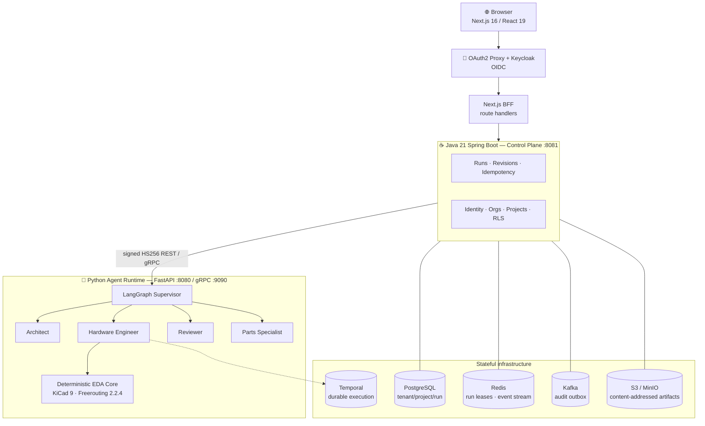
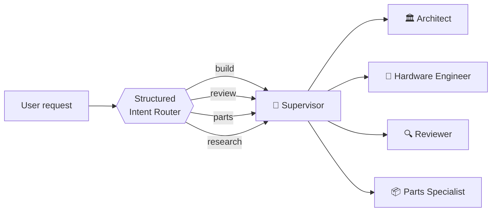
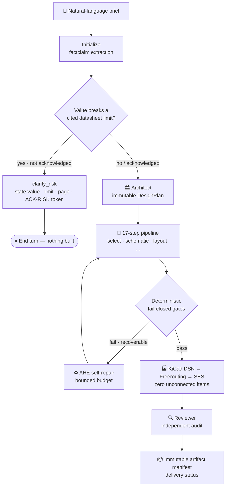

<div align="center">

# RatsNestPro

[English](README.md) · **简体中文**

**一个多智能体硬件工程平台:把一句自然语言需求,变成可制造、通过 DRC 的 KiCad PCB —— 并且拒绝谎报它到底做没做好。**

一支由 supervisor 编排的 LLM 智能体团队,完成 PCB 的设计、生成、验证、审查、修复与布线。
每一次"通过"都由确定性代码依据真实 EDA 工具输出和文件系统判定,绝不由模型自己的叙述说了算。

[](LICENSE)
[](https://www.python.org/)
[](https://github.com/langchain-ai/langgraph)
[](https://fastapi.tiangolo.com/)
[](https://nextjs.org/)
[](https://openjdk.org/)
[](https://github.com/AAADASDASSSSSSSSSSSS/wow/actions/workflows/test.yml)
[](#贡献)

[核心特性](#-核心特性) · [架构](#-架构) · [智能体团队](#-智能体团队) · [工作原理](#️-工作原理) · [快速开始](#-快速开始) · [配置](#-配置) · [文档](#-文档)

</div>

---

## 目录

- [RatsNestPro 是什么?](#ratsnestpro-是什么)
- [它凭什么不一样](#它凭什么不一样)
- [核心特性](#-核心特性)
- [架构](#-架构)
- [智能体团队](#-智能体团队)
- [工作原理](#️-工作原理)
- [技术栈](#-技术栈)
- [快速开始](#-快速开始)
- [配置](#-配置)
- [使用示例](#-使用示例)
- [项目结构](#-项目结构)
- [测试与基准](#-测试与基准)
- [安全](#-安全)
- [文档](#-文档)
- [路线图](#️-路线图)
- [贡献](#贡献)
- [许可证与致谢](#许可证与致谢)

---

## RatsNestPro 是什么?

给 RatsNestPro 一句用大白话写的硬件需求 ——

> *"设计一块两层的 STM32F103C8T6 板子,USB-C 供电(只供电,不走数据),一路 3.3 V,一颗 SPI flash,一颗 I²C 传感器,PC13 上接一个状态 LED。"*

—— 它就会把这句话送进一条真实的 EDA(电子设计自动化)管线,产出一个完成布线的 KiCad 工程,外加一份不可变、可下载的产物清单(artifact manifest)。需求分析、器件选型、原理图与布局生成、自动布线、独立审查、有预算约束的自修复,全部由一支各有分工的智能体团队完成。

名字就点明了目标:*ratsnest*(飞线)是一块新板子上那团尚未布线的连接。RatsNestPro 把这团乱麻理成一块干净、经过验证、可以投产的板子。

它有两种形态:

- **一个 LangGraph 智能体运行时**,可在本地运行,用 Streamlit 控制台驱动 —— 适合开发和评测。
- **一套生产级多租户 SaaS 外壳** —— Next.js 浏览器工作台、Java 控制面、OIDC 认证、持久化 run、审计流、内容寻址的产物存储。

RatsNestPro 构建于开源框架 [agent-service-toolkit](https://github.com/JoshuaC215/agent-service-toolkit) 之上。

---

## 它凭什么不一样

多数"AI 帮你画 PCB"的 demo,都让语言模型自己给自己判卷:模型说一句"板子看着没问题,检查都过了",这句话就成了结论。RatsNestPro 建立在相反的原则上。

> **信任边界是确定性的。** LLM 只决定*做什么*、并*解释*结果,它永远不决定*是否通过*。门禁裁决、ERC/DRC 结果、连通性、器件身份,全部由确定性代码计算,而这些代码只读工具输出和文件系统 —— 所以一份报告**没法靠措辞把板子说得比实际更好。**

这条原则派生出三个定义了整个项目的结果:

1. **Fail-closed 门禁。** 一条 17 步、知识驱动的管线,每一步都有失败即阻断的检查。被降级的检查仍会连同它所覆盖的引用一起报出来,绝不悄悄删掉。
2. **有据可查,而非凭空捏造。** 器件来自本地 JLCPCB 目录(不编造 MPN/LCSC 编号)。符号与封装对照已安装的 KiCad 库解析。布线必须真正完成:KiCad DSN → Freerouting → SES,**零未连接项**是一道阻断性生产门禁。
3. **诚实的交付状态。** 一次 run 只会落到三种状态之一:`execution_blocked`、`delivered_with_issues`、`release_ready`。是否可交付由证据推导,绝不从叙述文字里猜。

---

## ✨ 核心特性

### 🤖 一支真正角色化的智能体团队
不是一堆名字里带 "agent" 的类。一个 LangGraph **supervisor** 把任务委派给四个各有独立 prompt、契约、权限和受限工具权限的专家。交接用带类型的 Pydantic 模型,而不是自由散文。举例:Hardware Engineer 只能执行经过校验的 `set_param` 操作 —— 不能写任意文件,也不能执行 shell。

### 🔒 确定性 fail-closed 验证
权威核心是确定性的。17 步管线跑真实的 ERC/DRC 和连通性检查;门禁一旦失败就阻断,并给出可执行的整改指令。独立的 Reviewer **无权改动门禁严重度** —— 它只审查、只叙述,不推翻。

### 🧠 build 前的风险仲裁(ACK-RISK)
任何设计动作开始前,`build` 请求都会先对照器件的 **fact sheet** 仲裁。如果某个请求值突破了被引用的 datasheet 限值,图会停下来,明确说出这个值、限值、它出自哪一页,以及能接受它的那个 `ACK-RISK:` token。确定性代码会丢弃任何并非真正提供过的 token —— 所以一个幻觉的或过于慷慨的回答,**无法豁免一条用户根本没见过的限值。**

### ♻️ 自愈与自进化(AHE + EHE)
- **AHE —— Agentic Hardware Engineering:** 在单次任务内,观察 → 诊断 → 修复 → 继续,受严格预算约束(修复次数、墙钟时间、token)。
- **EHE —— Evolutionary Harness Engineering:** 跨任务归纳反复出现的能力缺口,再在隔离环境里生成、验证并发布 harness 改进。

### 🧭 结构化意图路由
可靠地区分 **build / review / parts / research**,让长需求里埋着的 "Reviewer"、"ERC" 或一个 `.kicad_pcb` 文件名,不会把主任务分类带偏。

### 🏭 真实 EDA 工具链
运行时镜像内置 Debian **KiCad 9**、**Java 25** 和 **checksum 锁定的 Freerouting 2.2.4**。符号/封装对照真实库做有据解析;确定性自动布线,直到板子完全连通。

### 🏢 生产级 SaaS 控制面
多租户身份、项目与 run;幂等的 run 创建;可续传、带事件重放的 SSE;不可变 run revision;基于 Temporal 的持久化执行;at-least-once 的 Kafka 审计;内容寻址的产物,配短时、需授权的下载 URL。

### 🔌 provider 无关
OpenAI · Azure OpenAI · Anthropic · Google Gemini / Vertex AI · AWS Bedrock · Groq · DeepSeek V4 · OpenRouter · Ollama · **EricAI**(Ericsson 内部网关)。可观测性走 Langfuse 和 LangSmith。

---

## 🏗 架构

浏览器从不直接和智能体运行时对话。每个请求先在边缘完成认证,由 Java 控制面授权并做幂等处理,然后才通过一条**签名**的内部通道转发给 Python 运行时。



**签名的内部边界。** Java 只向 `/internal/v1/**` 发送 snake-case DTO,并对每个请求签发一个 90 秒的 HS256 bearer token,token 绑定了 issuer、audience、principal、tenant、project、run、HTTP method、精确路径和请求体的 SHA-256 摘要。Python 从被验证的 subject 推导执行者身份,并拒绝请求体里任何 `user_id`。浏览器输入永远不携带 `tenantId`、`userId` 或运行时凭据。

**契约优先。** 对外和对内的 wire format 与各自的传输独立版本化(`contracts/public/v1`、`contracts/agent-runtime/v1` —— JSON Schema + protobuf)。HTTP 是默认传输;版本化的 gRPC 边界按需开启。

---

## 👥 智能体团队



| 智能体 | 职责 | 权限边界 |
| --- | --- | --- |
| 🏛 **Architect** | 需求研究(web search)、器件族判断、参数选型,产出**不可变的 `DesignPlan`** | 仅做建议性研究;不能改动门禁裁决 |
| 🔧 **Hardware Engineer** | 跑完整 17 步管线:生成、验证、修复 | 只能做校验过的 `set_param` 操作 —— 不写任意文件、不执行 shell |
| 🔍 **Reviewer** | 独立审查任意 KiCad 工程;保严重度的叙述 | **不能改动**权威门禁严重度 |
| 📦 **Parts Specialist** | 在本地 JLCPCB SQLite 缓存里做有据检索 | 不能捏造 MPN / LCSC 数据 |

supervisor 可以只选一个角色,也可以做顺序交接(例如*先生成、再审查* → Hardware Engineer → Reviewer)。每一次转交都会流式推给 UI,委派过程实时可见。

---

## ⚙️ 工作原理

一个 `build` 请求依次流过:仲裁 → 规划 → 管线 → 门禁 → 布线 → 审查 → 不可变清单。风险问题(若有)未回答前,什么都不会生成 —— 所以早期改一个值,回退成本为零。



**17 步知识驱动管线**覆盖器件族选择、有据器件选型、原理图连接、ERC、布局摆放、平面/层规划、布线、DRC 和出报告 —— 每一步都由读取真实工具输出的检查把关。下面这些是这些确定性检查抓得住、而纯 LLM 流程会漏掉的缺陷示例:

- 一个安装孔被"选"成了 6 脚有源振荡器,然后标注成 `mechanical`;
- 需求要 HSE 通道,晶振却被接到了 32.768 kHz 的 LSE 通道 —— 靠读符号的 alternate 引脚名抓出来,而不是看那个具有误导性的网络名;
- 一个两端子电容被短接在同一个网络上,这种情况 KiCad 默认 ERC 并不报;
- 需求点名的一个 GPIO(PC13)在网表里从未出现。

**用例基准套件作为度量基线。** 因为同一份需求在不同 run 里曾产出过 0 到 26 个网络,设计侧的改动都要对照一份记录在案的基线套件评判 —— 而不是看某一次走运的 run。评分只读工具结果和文件系统检查,所以**报告没法靠改措辞变好看。**

---

## 🧰 技术栈

| 层 | 技术 |
| --- | --- |
| **智能体运行时** | Python 3.12+ · LangGraph 1.x · FastAPI · Pydantic 2 · gRPC · Temporal |
| **控制面** | Java 21 · Spring Boot · Flyway(expand/contract 迁移) |
| **Web** | TypeScript · Next.js 16 · React 19(BFF route handlers) |
| **数据与消息** | PostgreSQL(多租户 + RLS)· Redis · Kafka · S3 / MinIO |
| **身份** | Keycloak · OAuth2 Proxy(OIDC) |
| **EDA 工具链** | KiCad 9 · Freerouting 2.2.4(checksum 锁定)· Java 25 |
| **LLM providers** | OpenAI · Azure · Anthropic · Google Gemini/Vertex · AWS Bedrock · Groq · DeepSeek V4 · OpenRouter · Ollama · EricAI |
| **可观测性** | Langfuse · LangSmith |
| **交付** | Docker Compose · Kubernetes(Kustomize overlays) |
| **接口** | Streamlit 控制台 · Next.js 工作台 · Python client SDK · 语音(TTS/STT)· AG-UI |

---

## 🚀 快速开始

### 前置条件
- [Docker](https://www.docker.com/) 与 Docker Compose
- 至少一个 LLM provider 的 API key(或用 `USE_FAKE_MODEL=true` 仅做冒烟测试 —— supervisor 路由需要真实模型)

### 1. 克隆并配置

```bash
git clone https://github.com/AAADASDASSSSSSSSSSSS/wow.git ratsnestpro
cd ratsnestpro
cp .env.example .env
```

在 `.env` 里配一个 provider(以 DeepSeek 为例;任何受支持的 provider 都行):

```dotenv
DEEPSEEK_API_KEY=sk-your-deepseek-api-key
DEEPSEEK_BASE_URL=https://api.deepseek.com
DEFAULT_MODEL=deepseek-v4-flash
USE_FAKE_MODEL=false
```

### 2. 启动整套服务

```bash
docker compose up --build
```

Compose 会把 PostgreSQL、Redis、Kafka、Temporal、Keycloak、MinIO,连同 Python 运行时、Java 控制面和 Next.js 前端一起拉起来。KiCad + Freerouting 工具链已经烤进运行时镜像。

| 服务 | 地址 |
| --- | --- |
| Web 工作台(经 OAuth2 Proxy) | `http://localhost:8088` |
| Java 控制面 | `http://localhost:8081` |
| Python 运行时(REST / gRPC) | `http://localhost:8080` / `:9090` |

### 3. 或者只在本地跑智能体运行时(更轻,适合开发)

```bash
pip install uv
uv sync --frozen
source .venv/bin/activate          # Windows: .\.venv\Scripts\Activate.ps1
python src/run_service.py          # FastAPI 运行时,:8080
streamlit run src/streamlit_app.py # 控制台,:8501,选择 "ratsnestpro-multi-agent"
```

---

## 🔧 配置

通过 `DEFAULT_MODEL` 只设一个默认 provider;key 只存在 `.env` 里,绝不提交,也不烤进镜像。

| Provider | 环境变量 |
| --- | --- |
| OpenAI / Azure | `OPENAI_API_KEY` / `AZURE_OPENAI_API_KEY` |
| Anthropic | `ANTHROPIC_API_KEY` |
| Google Gemini / Vertex | `GOOGLE_API_KEY` / `GOOGLE_APPLICATION_CREDENTIALS` |
| AWS Bedrock | `USE_AWS_BEDROCK=true` |
| Groq / DeepSeek / OpenRouter | `GROQ_API_KEY` / `DEEPSEEK_API_KEY` / `OPENROUTER_API_KEY` |
| Ollama(本地) | *(无需 key)* |
| EricAI(Ericsson 内部) | `USE_ERICAI=true` —— 见 [`docs/EricAI.md`](docs/EricAI.md) |

几个关键的 EDA 与可靠性开关(完整列表见 `.env.example`):

```dotenv
RATSNESTPRO_REQUIRE_FREEROUTING=true   # 零未连接布线是一道阻断门禁
RATSNESTPRO_AHE_ENABLED=true           # 有预算约束的任务内自修复
RATSNESTPRO_TEMPORAL_ENABLED=true      # 持久化的 Hardware Engineer 执行
```

---

## 💡 使用示例

在 Streamlit 控制台(或 Next.js 工作台)里选 `ratsnestpro-multi-agent`,试试:

```text
# 生成不可变设计计划
为 ATmega328 USB-C 5V 16MHz 开发板生成不可变设计计划,run_name 用 demo-plan。

# 跑完整 17 步 PCB 流程
运行完整 17 步 PCB 流程:ATmega328 USB-C 3.3V 8MHz,run_name 用 demo-pcb。

# 独立审查一个已有 KiCad 工程
审查 runs/demo-pcb 里的 KiCad 工程并生成 Markdown 报告。

# 有据器件检索
在本地 JLCPCB 缓存中搜索 10k 0603 电阻。
```

原始 CLI 也装在运行时镜像里:

```bash
docker compose run --rm agent_service ratsnestpro --help
```

---

## 📁 项目结构

```text
.
├── src/
│   ├── agents/
│   │   └── ratsnestpro/          # 多智能体 PCB 团队
│   │       ├── ratsnestpro_agent.py   # supervisor + 子智能体(entrypoint)
│   │       ├── intent.py              # 结构化意图路由
│   │       ├── capability.py          # capability profiles
│   │       ├── decisions.py           # HITL 决策菜单
│   │       ├── evidence.py / local_evidence.py
│   │       ├── diagnosis.py / repair.py    # AHE 自修复
│   │       ├── tools.py / web_tools.py
│   │       └── profiles/              # capability profile 定义
│   ├── service/                  # FastAPI 运行时:REST/SSE、gRPC、Kafka、Redis registry
│   ├── core/                     # 配置 + 多 provider LLM 工厂
│   ├── schema/                   # 共享 Pydantic 契约
│   ├── voice/                    # TTS / STT
│   └── streamlit_app.py          # 开发控制台
├── backend/                      # Java 21 Spring Boot 控制面
├── frontend/                     # Next.js 16 / React 19 工作台 + BFF
├── contracts/                    # 版本化的对外 + 对内契约(JSON Schema、protobuf)
├── cases/                        # 自然语言基准用例(度量基线)
├── deploy/k8s/                   # Kustomize base + overlays
├── docker/                       # Dockerfile、Keycloak realm、Postgres init
├── scripts/                      # 用例套件、冒烟测试、EricAI 运行器
├── tests/                        # agents、service、client、app、integration、voice
├── compose.yaml
└── langgraph.json
```

---

## 🧪 测试与基准

```bash
uv run pytest                          # 全套
uv run pytest tests/agents             # RatsNestPro 工作流、工具、风险、意图、证据
uv run pytest -m "not docker"          # 跳过依赖容器的集成测试
```

- **单元/工作流测试**覆盖意图路由、风险仲裁、决策、证据门禁和修复。
- **用例套件**(`scripts/run_case_suite.py`)是度量基线。它记录每次 run 的完成步数、首个阻断步、ERC/DRC 数、修复轮次和 `verdict` 分布 —— 并与保存的基线对照,让真实改进和 run 间方差可区分。

```bash
python scripts/run_case_suite.py --repeat 2
python scripts/run_case_suite.py --compare data/ratsnestpro/suite/<基线>.json data/ratsnestpro/suite/<新>.json
```

---

## 🔐 安全

- **仓库里没有 secret。** 不提交 `.env`。生产 OIDC、Kafka TLS/SASL、S3 凭据和内部签名密钥必须来自外部 secret manager。自带的 Keycloak realm **仅供本地开发**。
- **专用的内部签名密钥**(≥ 32 字节),绝不复用 OIDC client secret 或 session key。网络策略必须让浏览器和不受信工作负载够不到 Python 内部端口。
- **最小权限数据库角色。** 运行时登录用 `ratsnest_app`,带 `NOSUPERUSER NOBYPASSRLS`,不拥有 schema。迁移作为独立的 Flyway job 运行。
- **供应链冷却期。** 依赖解析忽略 7 天内的新版本(`[tool.uv] exclude-newer`)。

> ⚠️ `deploy/k8s/` 里的清单是继承来的产品外壳脚手架,任何生产部署前都需要针对具体环境验证(secret、TLS、网络策略、资源限制)。

---

## 📚 文档

| 文档 | 主题 |
| --- | --- |
| [`docs/RatsNestPro_Integration.md`](docs/RatsNestPro_Integration.md) | 多智能体设计、风险仲裁、能力边界 |
| [`docs/Intent_Routing_and_AHE_EHE.md`](docs/Intent_Routing_and_AHE_EHE.md) | 结构化意图路由与 AHE + EHE 双环架构 |
| [`docs/EricAI.md`](docs/EricAI.md) · [`docs/Ollama.md`](docs/Ollama.md) · [`docs/VertexAI.md`](docs/VertexAI.md) | provider 接入 |
| [`docs/Production_Readiness_Plan.md`](docs/Production_Readiness_Plan.md) | 生产就绪计划 |
| [`contracts/README.md`](contracts/README.md) | 对外与对内 API 契约 |
| [`backend/README.md`](backend/README.md) · [`frontend/README.md`](frontend/README.md) | 控制面与 Web 工作台 |
| [`cases/README.md`](cases/README.md) | 基准套件方法论 |

---

## 🗺 路线图

- [ ] SAME54 工业网关用例(RMII PHY、CAN-FD、microSD、0–10 V 模拟输入、四层板),用于覆盖符号获取的回退阶梯
- [ ] `factclaim` 降压链识别(把稳压器输入电压和逻辑供电电压区分开)
- [ ] 把器件族覆盖扩展到确定性 ATmega328 参考板之外

---

## 贡献

欢迎 issue 和 PR。请:

1. 开 PR 前跑 `uv run pytest` 和 `uv run ruff check`。
2. 任何设计侧改动,附上一份对照当前基线的 `run_case_suite.py --compare` 结果 —— 改动对照套件评判,而非单次 run。
3. 遵循仓库简洁的注释风格(见 `CLAUDE.md`):注释解释*为什么*,不解释*做了什么*。

---

## 许可证与致谢

以 [MIT License](LICENSE) 发布。

构建于 Joshua Carroll 的开源项目 [agent-service-toolkit](https://github.com/JoshuaC215/agent-service-toolkit)。Web 工作台借鉴了 [uiverse-io/galaxy](https://github.com/uiverse-io/galaxy) 的 MIT 许可交互样式。PCB 自动布线由 [Freerouting](https://github.com/freerouting/freerouting) 提供;EDA 由 [KiCad](https://www.kicad.org/) 提供。

<div align="center">

**RatsNestPro** —— 从一句话到一块布好线的板子,配上一套没法靠嘴皮子糊弄过去的检查。

</div>
